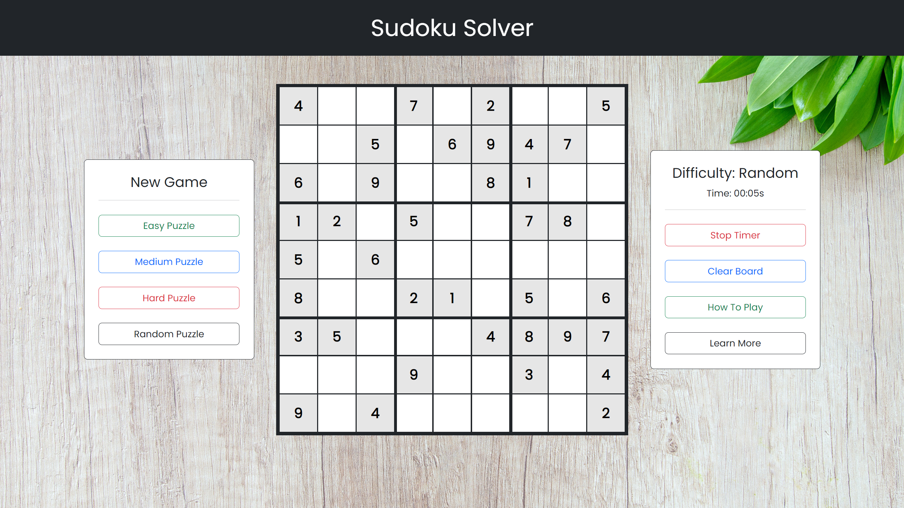

# Sudoku Solver

<div align="center">

</div>

## Description

Sudoku Solver is a React based web application that generates a valid Sudoku puzzle that users can interact with while keeping track of their elapsed time. Users can generate puzzles at various difficulties so that they can start a new board if they get stuck, find the puzzle too easy, or want something unpredictable. While playing, users can also choose to stop the timer to track their progress, clear the puzzle from the board to start over, or learn more about the game and how it was made.

<div align="center">

</div>

## Table of Contents

* [Development](#development)
* [Installation](#installation)
* [Usage](#usage)
* [Reflection](#reflection)
* [Contributing](#contributing)
* [Credits](#credits)
* [License](#license)

## Development

React is great for creating iterative components so that developers don't have to waste time updating and testing similar elements. However, another pillar of utility behind React is the ability for components to have state by keeping track of their own information. Two predominate examples of stateful behavior in this application include the management of puzzle data and the updating of the board timer as seen in the code exerpt above.

```js
class App extends Component {
    constructor(props) {
        super(props);
        this.timer = 0;
        this.state = {
            time: 0,
            difficulty: null,
            values: null
        };
    }

    startTimer = () => {
        if (this.timer === 0) {
            this.timer = setInterval(() => {
                this.setState({ time: this.state.time + 1 });
            }, 1000);
        }
    }

    stopTimer = () => {
        clearInterval(this.timer);
    }

    resetTimer = () => {
        this.stopTimer();
        this.setState({ time: 0 });
        this.timer = 0;
        this.startTimer();
    }

    generateNewBoard = (level) => {
        level ? this.resetTimer() : this.stopTimer();
        const requestParam = level ? "?difficulty=" + level : level;
        fetch(`https://sugoku.herokuapp.com/board${requestParam}`)
            .then(result => result.json())
            .then(data => this.setState({ values: data.board, difficulty: level }))
            .catch(err => console.log(err));
    }

    componentDidMount = () => {
        this.startTimer();
        this.generateNewBoard("random");
    }

    componentWillUnmount = () => {
        this.stopTimer();
    }
}
```

## Installation

To install the required npm packages to run this application, clone the repository and run the following command:
```sh
npm install
```

## Usage

To use this application, run the following command:
```sh
npm start
```

## Reflection

This project was created with the intention of practicing the creation of a full stack web application from scratch so that I could further my experience with the React Lifecycle, React Bootstrap, and responsive web design. I know that the best way to improve my skills as a web developer is to practice creating personal projects that meet a minimum viability so that I can familiarize myself with the full process of app development. If I were to make this application again in the future, I would challenge myself by creating my own backend sudoku board generation API and create a collapsable mobile-only menu.

## Contributing


<h3><b>Simon Newton</b></h3>
<hr align=left width=325 />
<p>Junior Full-Stack Web Developer</p>
<a href="https://github.com/simonanewton" target="_blank">GitHub Profile</a> | <a href="https://www.linkedin.com/in/simon-newton-2a7440129/" target="_blank">LinkedIn Profile</a> | <a href="https://simonanewtondev.herokuapp.com/" target="_blank">Personal Website</a>

## Credits

External Sudoku API
* https://github.com/bertoort/sugoku

Website Background Image
* https://unsplash.com/photos/EWDvHNNfUmQ

Primary NPM Packages
* https://www.npmjs.com/package/react
* https://www.npmjs.com/package/express
* https://www.npmjs.com/package/bootstrap
* https://www.npmjs.com/package/react-bootstrap

## License

[](https://simonanewton.mit-license.org)

MIT License &copy; Simon Newton <https://simonanewton.mit-license.org>